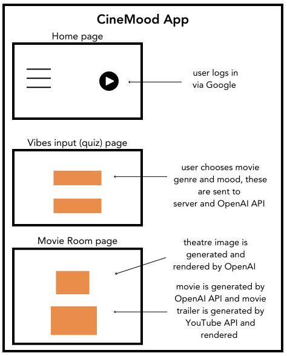

# Project Team README

## Cooperation Plan

### Team Strengths

- **Negin Koushkakinjad**
  - Key strengths: Problem solving, passionate, attention to detail
- **Zach Moore**
  - Key strengths: Detail-oriented, determination
- **Lana Zumbrunn**
  - Key strengths: Design, wireframe, layouts, business perspective, positive attitude
- **Errol Vidad**
  - Key strengths: Solid contribution in all areas, project management
- **Christopher Acosta**
  - Key strengths: JavaScript

### Utilizing Strengths

- Encourage collaboration
- Teach each other as needed
- Maintain a clear understanding of scope and outcomes
- Implement project management iterations for timeline progression

### Professional Competency Development

- **Negin:** Technical
- **Zach:** Technical and networking
- **Chris:** Business perspective
- **Lana:** Technical and networking
- **Errol:** Quality and level of excellence

### Day-to-Day Work Approach

- Daily standups
- To-dos
- Address blockers immediately
- Utilize Slack for collaborative work

## Conflict Plan

### Conflict Resolution Process

- Express frustration humorously (e.g., CAPS)
- Hold team meetings to discuss pros and cons
- Team vote with a 4th person tiebreaker
- Mediation by John in case of a tie

### Addressing Dominant Project Contributions

- Politely inquire about stress and redirection
- Rate team feelings on a scale of 1-5
- Discuss concerns during daily meetings

### Handling Unequal Skill Levels

- Ask for help regularly
- Exercise patience
- Treat individual understanding as a team understanding

### Raising Concerns about Contribution

- Address concerns with empathy
- Discuss in daily meetings
- Escalate to John if unresolved during standup

## Communication Plan

### Availability

- **Chris:** Whenever 24/7
- **Lana:** 8:30 am - 10 pm Pacific with about an hour out in the evening
- **Negin:** 9 am - 6 pm Pacific, flexible
- **Errol:** 9 am - 6 pm Pacific
- **Zach:** 8:30 am - 9 pm Pacific
- Standup at 9 am Pacific

### Communication Platforms

- Slack

### Breaks and After-Hours Communication

- Take breaks as needed
- Use Slack for after-hours and weekend communication

### Ensuring Everyone's Voice is Heard

- Listen actively
- Ask for input
- Encourage open communication in stand-ups

### Creating a Safe Environment

- Patience for questions (Lana)
- Judgment-free zone (Errol)
- Free of judgment, talk about everything (Negin)
- Open, direct communication (Chris)
- Ability to communicate, mutual respect (Zach)

## Work Plan

### Task Management

- Identify tasks collectively
- Assign tasks based on strengths
- Monitor completion and progress
- Leverage experience from 201

### Project Management Tool

- Github project management

## Presentation Deck

### Presentation Preparation

- [Link to Presentation Deck]
- Schedule practice sessions
- Plan a 30-45 minute meeting for practice and feedback

### Presentation Etiquette

- Express gratitude genuinely
- Maintain eye contact with the audience/camera
- Stay positive during the presentation

## Git Process

### Git Workflow

- Components of the project will live on GitHub
- Share the repository through cloning
- Git flow as discussed in class

### PR Review Workflow

- Minimum of 1 person to review a PR
- Anyone can merge PRs
- Merge as needed
- Communicate merge readiness via Slack and other collaboration channels

## Wireframes

## Domain Model

=======

